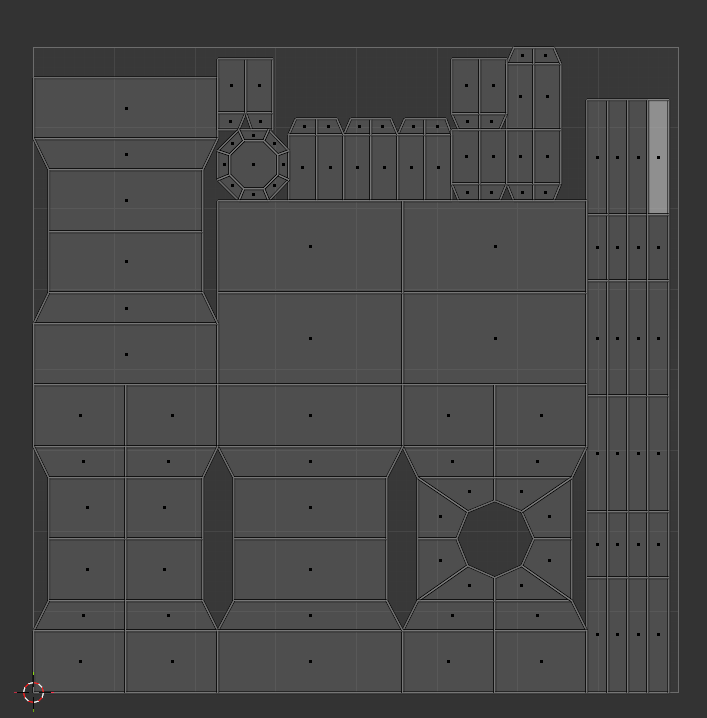

# The Hammer

Welcome, perhaps to your first Blender tutorial!
Today we will be going over how to create some simple low poly models, as seen below:

## Modeling The Hammer

We will start with the hammer.

To create this weapon, we shall block it out using 2 basic shapes:

* Cube
* Cylinder

### The Hammer Head

With blender open, you will notice we already have one of those shapes in the scene.

.png>)

This cube will be the head of the hammer.

We need to scale the cube to resemble the head of the hammer.

To scale you can press the ++s++ and ++y++ Keys and drag outwards with your mouse or pressing ++2++ on your numpad.
You may also scale by using the green square on the origin widget.

.png>)

Next, we need to move the head up to allow space for the handle.

By pressing ++g++ for grab and then ++z++ to lock to the Z-axis, we can move the cube upwards by 4 using ++4++ on your keyboard.

.png>)

Now to add the cylinder, this will block out the handle.

At the top left you will find the ++"add"++ button, from there we will find Mesh > Cylinder and add the handle to the scene.

.png>)

You will notice the cylinder is the default size, we can change this in the window at the bottom left hand corner.

Change the values to match the numbers you see in the image below to create a better looking handle.

.png>)

Now that we have blocked out the hammer, it is now time to add the finer details to the model.

By pressing ++tab++ you will enter edit mode where you can manipulate the model by its vertices.

!!! Note
    Pressing ++1++ will enter vertex select.

    Pressing ++2++ will enter edge select.

    Pressing ++3++ will enter face select.

.png>)

On the Left you will notice more tools have been added to the tool bar.

The first tool we will use is the loop cut tool.

When using this you will see a yellow line on the model showing where you are going to cut.

By default the line will appear in the center of the model.

.png>)

Once you have made the loop cut you can add more loops in the popup window on the bottom left, use this to add 3 more loops to the mesh for a total of 4.

.png>)

The reason we are adding these loops is to allow us to manipulate the shape of the hammer head.

In edge mode we will select the 2 centre edge loops by holding ++ctrl++ and clicking the front edges.

With them selected we can scale the edges outward by pressing ++s++ for scale and then ++y++ to lock movement to the Y-axis, press ++2++ to scale by 200% and click to confirm.

.png>)

Switching to face mode by pressing ++3++, we will select the outer faces of the hammer head like below.

.png>)

We will scale these faces outward using ++s++ for scale, this time locking it to exclude the Y-axis by using ++ctrl++ + ++y++ to scale along the X-axis and Z-axis at the same time.

Before confirming type `1.2` on your keyboard to scale to 120%.

.png>)

And that is all we need to do to model the hammer head!

!!! Bonus
    you can add a bevel to the edges of the face of the hammer to give it more detail.

    Use the bevel tool by pressing ++ctrl++ + ++b++ and dragging the mouse to set the bevel size.

    

### The Hammer's Handle

Now that we are done with the Hammer head we can move onto the handle.

To exit edit mode simply press ++tab++ again to enter back into object mode and then select the cylinder in the scene.

.png>)

Enter into edit mode by pressing ++tab++.

We will start with adding some loop cuts to the cylinder, in particular 6 cuts.

Remembering that you can add more loops in the popup window on the bottom left.

.png>)

Similar to what we did with the hammer head, we will select the 2nd and 5th rings that we had just created.

We will be scaling them up by pressing ++s++ and then ++z++ to lock it along the Z-axis, scale it up by 150% by entering `1.5` on your keyboard.

.png>)

Now that the loops have been moved outward, we will then press ++3++ to enter face mode and select all the faces in the middle of the handle, like so:

.png>)

Using the ++s++ key to scale then ++ctrl++ + ++z++ to lock the scaling perpendicular to the Z-axis, we can scale down to 75% by typing `0.75` then confirming.

.png>)

For the finishing touches, we are going to use a new tool, the Beveling tool.

Entering edge mode by pressing ++2++, select the bottom most edges of the cylinder, like so:

.png>)

Now press ++ctrl++ + ++b++ to use the Bevel tool, drag your mouse out to decide how big you would like the bevel to be.

Once you have confirmed the bevel you can alter it with the popup window on the bottom left of the screen. Set the values as seen below to get the desired effect.

.png>)

Now we have dealt with the finer details of the model, but there are a few things we need to do still.

.png>)

### Joining It All Together

Going back to object mode, you will notice when pressing ++A++ that the model is still in 2 parts.

We are now going to join them.

.png>)

To join them, with all object still selected, simply press ++ctrl++ + ++j++ to Join the objects into 1 singular object.

.png>)

There are still some points to clear up, and that is cleaning up the topology of the mesh.

Entering edit mode and navigating to where the handle meets the head, and entering vertex mode by pressing ++1++, we will begin to properly merge the meshes.

.png>)

Holding down ++Z++ and moving the mouse over "Wireframe" mode, you will now be able to see through the mesh and select verts, edges and faces that you would not have been able to before.

.png>)

Jumping into face mode you will now notice that each face has a dot on them, this represents the centre of the face and the selection point.

.png>)

In the image below I am box selecting the dot in the middle as I need to select both the face of the bottom side of the head, and the top face of the handle.

.png>)

You can tell if they are both selected if you can see a white ring around each of the faces.

Once they are both selected, we are going to delete these faces by pressing ++x++ and selecting "Faces" in the popup window.

For the next steps we can exit from wireframe view by holding ++z++ and moving the mouse over "Solid".

Now you will be able to see that the bottom face is missing from the hammer head, we will now fill this hole with the bridging tool.

.png>)

Before we can fill the hole, we need to add more loops to the hammer head to allow for better topology.

Add the first loop cut along the small of the head, just a single cut will do right in the center of it.

.png>)

Then we need to add another loop down the length of it, again just 1 in the middle.

.png>)

Now that we have given the mesh more geometry we can now add the faces to properly join the handle to the head.

.png>)

The simplest way from here is to enter edge select by pressing ++2++, and selecting the edges as seen below:

.png>)

Simply by pressing ++f++ you will make a face that bridges the gap between the edges.

.png>)

From here you will select the side edge of the face we have just made, like so:

.png>)

And press ++f++ again to create another face.

.png>)

Without clicking away, you can now continuously press ++f++ until all the faces have been made and the gap has been filled.

.png>)

One last thing before we move on.

At the top right of the window, you will find the outliner or the Scene collection. This is where you will find all the objects in the scene.

Your object may be called "Cube" or "Cylinder". By double clicking it, you can rename it.

We will call it "Hammer"

.png>)

Congratulations! You have successfully modeled the hammer!

Now onto the next part, UV Unwrapping...

## Unwrapping The Hammer

In 3D Modeling, UVs are used to apply textures to your mesh.

In this part I will show you the basic workflow on how to unwrap an object effectively in Blender.

In the top ribbon of the window, you will notice a few work spaces. The workspace we will be in today is "UV Editing".

Your scene will now look like this:

.png>)

Staying in edge mode, we will start to select edges of the mesh, singling out parts of the actual mesh that we want to be different colours.

I want the shaft of the handle to be a different colour than the pommel and the hilt, so I will isolate these faces.

Select the edges above the pommel and below the hilt like so:

.png>)

Also select a line of edges down the front, this is to break up the UV shell and to unfold the faces in UV space conformally.

.png>)

Once we have all those edges selected, Right click in the scene and navigate down to "Mark Seam" in the popup window, as seen below:

.png>)

You can tell if you have done this right if the edges now have a red highlight around them.

Next we shall do the same for the pommel.

Select the faces in the images below and then mark the seams.

.png>)

.png>)

The red lines should now look like this:

.png>)

Again repeat the same steps for the hilt, where the handle meets the head.

.png>)

.png>)

Next we shall mark the head.

Follow the images below to see what edges to mark:

.png>)

.png>)

The Hammer head should look like this:

.png>)

Also, mark the inner edges like so:

.png>)

Now that we have told the mesh the sections that need to be isolated, we will now unwrap the UVs.

To do this we will select all faces in the scene by pressing ++a++.

Then at the ribbon above the viewport, you will find the UV menu, click that.

In the drop down navigate to "Smart UV Project".

.png>)

A popup window will appear, we don't need to change anything here, so just click "Unwrap"

.png>)

On the left in your UV layout, you will see that it has organised the faces very well.

Don't panic if it does not look like this, depending on how you scaled and moved some parts of the mesh this part will be different.

Congratulations! You have unwrapped your first mesh!

Now onto Texturing.

## Material Setup

In blender to colour and shape objects we use something called a Material.

Materials use the UV to figure out what part of itself is projected onto the object.

To keep it simple we will be using a colour palette to shade the Hammer.

[Download 16 colour palette here (PNG)](../textures/16ColourPalette.png){download="16ColourPalette.png"}

Once you have clicked the text to download the texture we will then start to make the Material.

Similar to how we changed the workspace before, we will now select the "Shading" tab. your scene will then look like the image below:

In the window, there are a few things to note.

- Top left is a file explorer.
- Bottom left the image viewer.
- At the bottom of the screen the material node editor.
- and last but not least, in the middle is the rendered scene.

.png>)

To begin applying the texture, we first need to tell blender what we want to use.

We can do this by navigating to where you have downloaded the colour palette and selecting the image.

.png>)

With that selected and in view at the bottom left, we can now move to the material node editor.

You will see a node called "Principled BSDF", this is the node that gives the Hammer its colour.

From "Base colour" on the BSDF node, click and drag out.

.png>)

A popup menu will appear, here you must type "Image" and press ++enter++

.png>)

You may notice that only the head or the shaft has now changed colour, this is ok for now.

With the new image node, navigate to the image drop down and select the colour palette we loaded before.

.png>)

Now you will start to see the texture being projected onto the model, this is how you know it's worked.

.png>)

Now we are done with the shading workspace, let's go back to the layout workspace.

Now you may notice the texture is not applied to the model anymore, it is just that we can't see it.

At the very top right of the scene, you will find a drop down menu. In the drop down navigate to "Texture" under "Object" and click it.

.png>)

You can now see the texture on the material in the default space.

.png>)

Now let's fix the problem of the material not showing on the entire model.

Press ++tab++ to enter edit mode and then press ++a++ to select the entire mesh.

.png>)

To the right of the scene you will find a selection of colourful icons. From here click the red patchy sphere, it will open the material editor.

The only button we are interested in at this moment is the "Assign button", this will assign the material to every part of the object.

.png>)

## Texturing the Hammer

Jump back into the UV editing workspace in the top ribbon.

Here you will see how the UV shells project the material onto the mesh.

To make the next steps easier, ensure you are in face and shell select at the top left of the screen.

.png>)

To begin, let's play around with the shells and get used to this style of texturing.

Let's start with selecting one of the sides of the hammer, like below:

You will notice that when you select a shell in UV space it will also select the corresponding face of the mesh in the scene.

.png>)

You can use similar methods from the 3D scene in this 2D space.

For instance you can scale the shell down by using the ++s++ key and moving your mouse, away to scale up and closer to scale down.

.png>)

You can also use the ++g++ key to move the shell around in 2D space.

For this shell we want it to be grey like metal so we will move it to the grey square at the bottom.

.png>)

Similarly, we will do the same with the other shells of the hammer head, selecting them all in the UV space ensuring all the faces of the hammer head are selected.

.png>)

Scale down with ++s++

.png>)

Move into place with ++g++

.png>)

Let's say the hammer head is too gray, we need some flair to it!

Let's select these inner edges as seen below:

.png>)

Go to the top and click "UV" and then "Unwrap Angle Based".

This will cut the faces out of the original shells, this is so we can put them into a different colour square.

.png>)

With the new shells selected, complete the same steps as before to move them to your desired colour — for this I chose Yellow/Gold.

.png>)

Scale down with ++s++

.png>)

Move into place with ++g++

.png>)

Moving onto the hilt and pommel.

Now, you could make these different colours, but for simplicity, I'll make them the same colour.

Select all the shells that correspond to the pommel and hilt and move them to the colour you desire.

.png>)

Scale down with ++s++

.png>)

Move into place with ++g++

.png>)

Now all that is left is the grip of the handle.

For mine I chose to have it be wooden so I moved the shells into the brown square.

.png>)

Scale down with ++s++

.png>)

Move into place with ++g++

.png>)

And there you have it!

You have modeled your very own Lowpoly Fantasy War-Hammer!

Thank you for following my tutorial.
