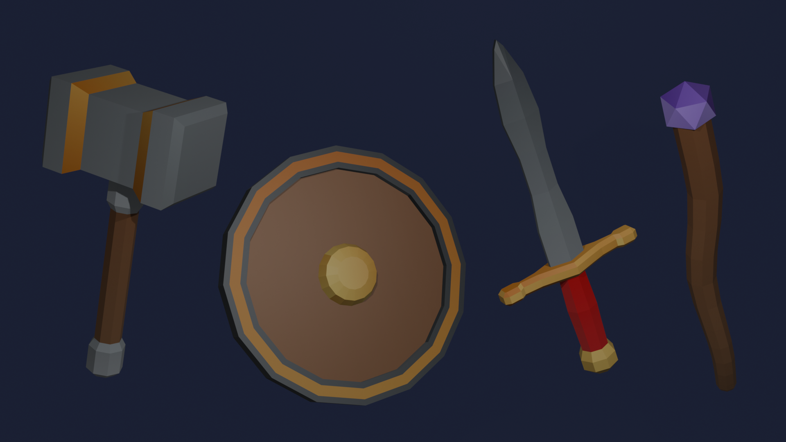

# The Shield

Welcome to to the next tutorial in the lowpoly fantasy weapon series!

In this section we will be going over how to make the Sheild, using very simple techniques.

!!! Note
    If you are starting on this tutorial, you may need to jump to the Hammer tutorial for material setup.

## Modeling The Shield

This one is a nice change of pace, instead of blocking things out with several separate shapes like the hammer and sword, the shield is modeled from a single cylinder using a handful of new tools.

Add a Cylinder (++"add"++ > Mesh > Cylinder), then scale it up on the X and Y axes so it becomes a wide, flat disc.

.png>)

Double-click it in the outliner and rename it "Shield". Once scaled up, our disc is 7m across and 0.5m thick.

.png>)

Enter edit mode and select the top face.

.png>)

Press ++i++ to **Inset Faces**, and move your mouse to create a border ring around the edge of the face, type `0.6` for the Thickness if you want to match this exactly.

!!! Note
    Inset Faces creates a smaller copy of a face inside itself, connected by a ring of new faces around the border. It's a quick way to add a frame or rim to any flat face.

.png>)

With the new inner face still selected, press ++e++ to **Extrude**, then ++z++ to lock it to the Z-axis, and type `-0.2` to push it down slightly. This creates a shallow, dish-like recess in the middle of the shield, with the outer ring left as a flat rim.

.png>)

Inset again on this new recessed face, this time with a much bigger Thickness, try `2`. This leaves a smaller ring within the dish.

.png>)

Extrude this new inner face upwards this time, ++e++, ++z++, and type `0.4`, to create a raised boss in the centre of the shield.

.png>)

Select the edges around the top of the boss and bevel them (++ctrl++ + ++b++) with a Width of `0.4m` and 2 Segments, to round it off into a smooth dome.

.png>)

Back in object mode, you should have a shield with a flat outer rim, a recessed dish, and a rounded boss in the middle.

.png>)

Let's do the same thing to the back of the shield so it isn't left as a flat, boring face. Select the bottom face and repeat the same steps: Inset with a Thickness of `0.6`, Extrude down `-0.2`, then Inset again with a Thickness of `1.5`.

.png>)

.png>)

.png>)

Now for some extra detail on the rim. Switch to the Knife tool (++k++) and click along the vertical wall between the outer rim and the recessed dish, adding a cut at each segment corner, then press ++enter++ to confirm. This slices the rim wall up into individual plate-like panels.

!!! Note
    The Knife tool lets you cut new edges anywhere you click, rather than being limited to full loops like the Loop Cut tool. It's great for adding detail to a specific area without affecting the rest of the mesh.

.png>)

Select a few of these new panel faces individually and move them (++g++ ++z++) in and out by small, slightly different amounts, try `-0.2` for one and `-0.05` for another. This breaks up the perfectly even rim into something that looks like riveted armour plating.

.png>)

.png>)

Back in object mode, take a look at your finished shield!

.png>)

Congratulations! You have successfully modeled the shield!

## Unwrapping The Shield

Switch to the "UV Editing" workspace.

.png>)

Because the shield started life as a cylinder, its default UV unwrap is actually already pretty tidy, you'll see the outer rim laid out as a strip, and the front and back faces unwrapped as neat circles.

.png>)

We just need one extra seam to separate the raised boss from the dish it sits in. Select the edge loop around the base of the boss and mark it as a seam, the same way you did for the sword's handle.

.png>)

Select all the faces with ++a++, open the UV menu, and choose **Smart UV Project** again.

.png>)

This gives us a clean set of separate islands for the rim, the front and back dishes, the boss, and all the little rim plates.

.png>)

Congratulations! You have unwrapped the shield!

## Texturing the Shield

As we have already set up the material in the Hammer tutorial, we will use the same Material for the shield too.

Head to the Material Properties tab, click the browse icon next to the material name box, and select the existing **Material** from the list, just like you did for the sword.

.png>)

The whole shield will now show the colour palette, all bunched up in a jumbled mess since none of the UV shells have been moved into place yet.

.png>)

Jump into the UV Editing workspace and you'll see the colour palette in the background of the UV layout, with all your shells sitting on top of it.

.png>)

Select the outer rim's shell and move (++g++) it onto one of the gold or orange squares.

.png>)

Do the same for the little rim plate shells, select them and move them onto a colour of your choice, scaling them down first with ++s++ if you want more of the square to show through.

.png>)

.png>)

Keep working through the rest of the shells, the front dish, the boss, and the matching shells on the back of the shield, moving each one onto a colour you're happy with.

!!! Note
    It's easy to miss a shell tucked away somewhere in the UV layout, leaving one part of the model an odd plain white or grey. Once you think you're done, rotate your model around in object mode and check every face has picked up a colour before moving on.

.png>)

Once every shell has a colour, jump back to object mode to see the finished result.

.png>)

Congratulations! You have successfully textured and finished the shield!
