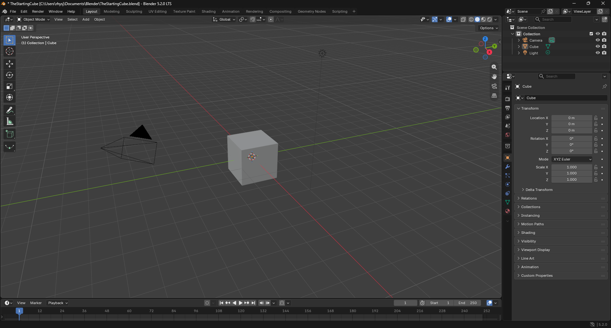
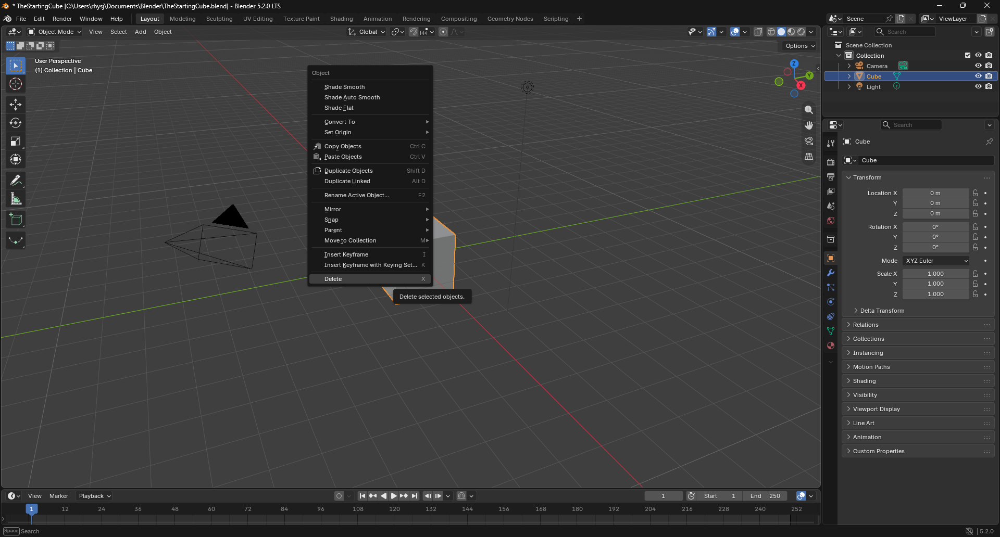
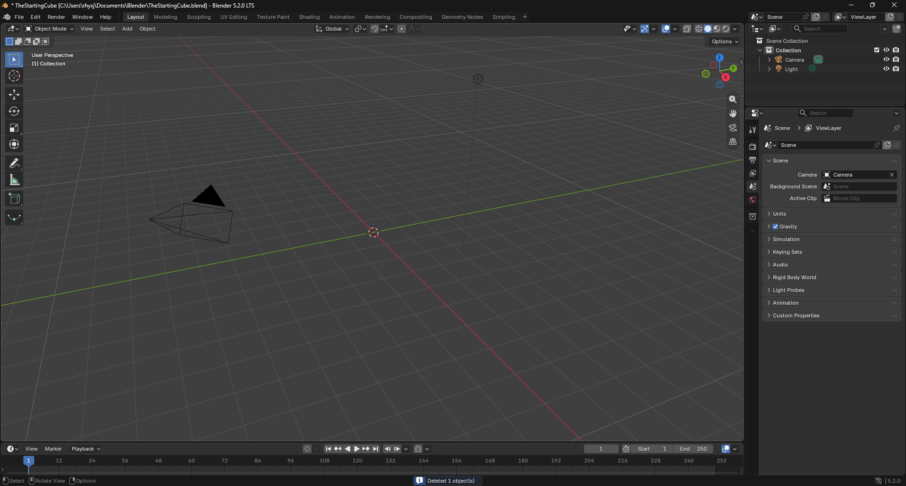
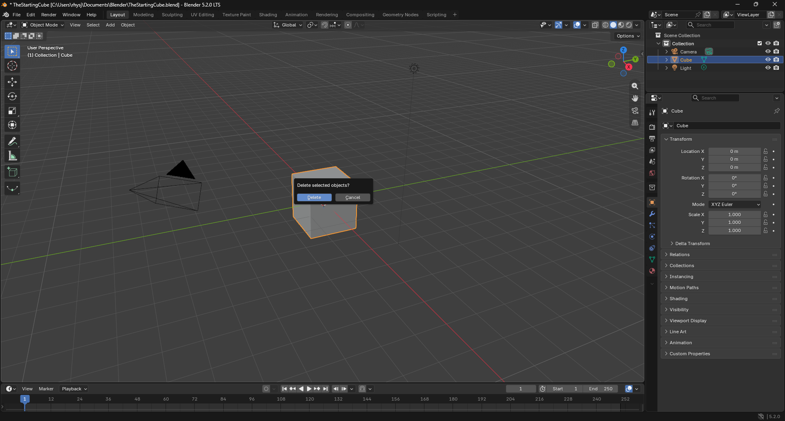
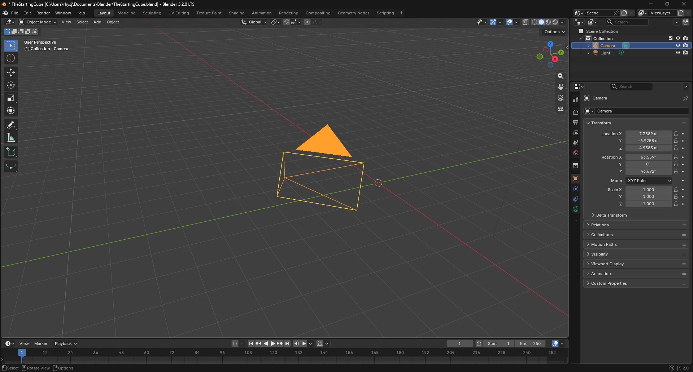
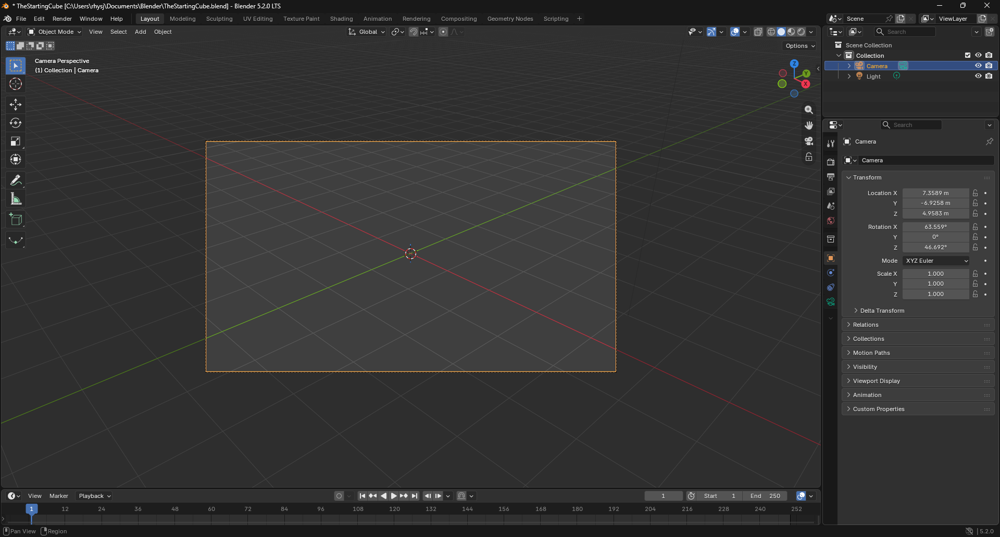
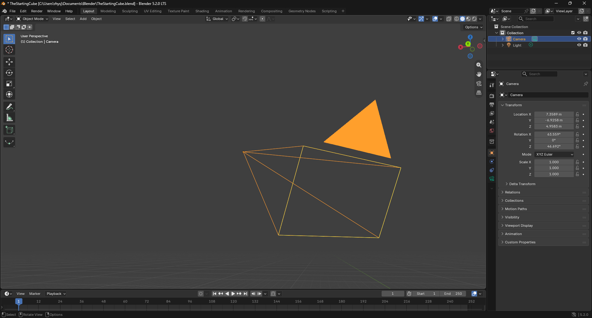

# The Starting Cube

## First Steps
Once you have opened blender you will notice the starting cube, as seen bellow

Select by left clicking the cube, then right click.

At the bottom of the popup window, you will see the delete button, click that.

Congradulations! You have now deleted the starting cube!

!!! Note
    At the the very bottom of the screen you will see a blue notification, this will let you know what was deleted and how many.

!!! Note
    Alterantively, you can select the cube and press ++x++ on your keyboard.

    Then press the "Delete" button on the popup window.
    
    

## Scoping the Scene

You may have noticed there are other Objects in the scene. 

### The Camera

We will start with the one on the left, click the object and if you have a num pad on your keyboard press the ++"."++ key on your keyboards number pad, to zoom in on the object.

This object is a camera, it is used to capture 2D images from your 3D sceneor in other words a Render image.

If you wish to see what the camera is viewing, press ++0++ on your keyboards number pad and you will the possess the camera.

Pressing ++0++ on you keyboards number pad will then set posseion back to the scene camera.

To inspect the object you are viewing, you can hold down middle mouse wheel and move the mouse around to move the camera around the focal point whichj is not the object.

## Working with Cubes

At the top left

## Working with Spheres

## Working with Cylinders

## Working with Susane

